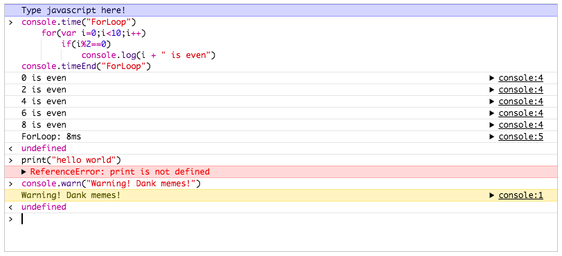
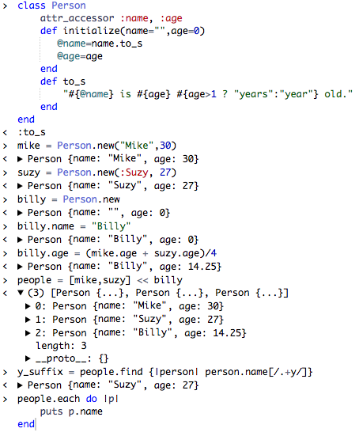
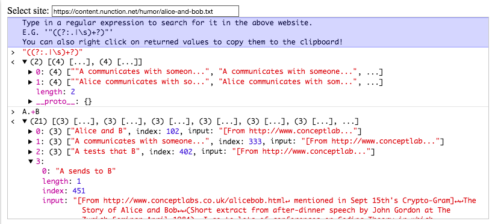

# Chrome Console
Console.js is an open-source embeddable console, written in JavaScript. It attempts to match most of the features provided by Chrome's JavaScript console and is easy to embed into any web page or browser application like NW.js and Electron.

The console itself doesn't provide language evaluation, but merely provides the user interface. By allowing developers to provide their own language evaluation we extend the number of potential uses of the library. For example, the library can can be used to make REPLs for other languages, here, Ruby:

Or used to build handy utilities, like this utility which searches a URL for a given regex:

Please visit the [project's website](https://tarvk.github.io/chromeConsole/About.html) to learn how to embed the console into your website, and build it to your own needs.

## Todo:
* Wrap object overflow properly.
* Make a fix for Edge (\<details\> not implemented).
* Major browser support (e.g. Edge).
* Make it so parameters of functions are shown
